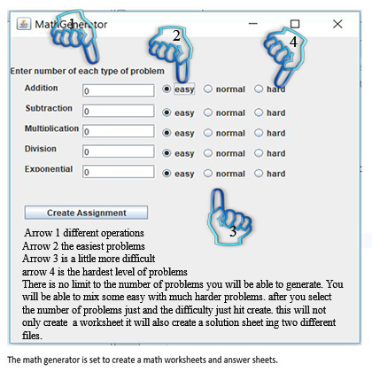

# How to Use
Once the application is running:  
1)Type in the number of problems you want for each type of problem.
2)Select the difficulty you want for each of the problem types you selected.(Defaults to easy.)  
3)Hit the Generate Button.  
4)Select where you want to save the files.  
5)Navigate to where you saved them.  
6)Open the questions.html & solutions.html Web Browser.(Reccomend Google Chrome for Print Preview.)  
7)Print the files and use!

